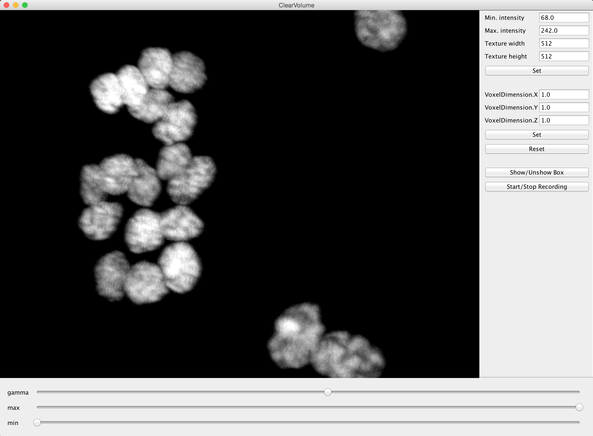
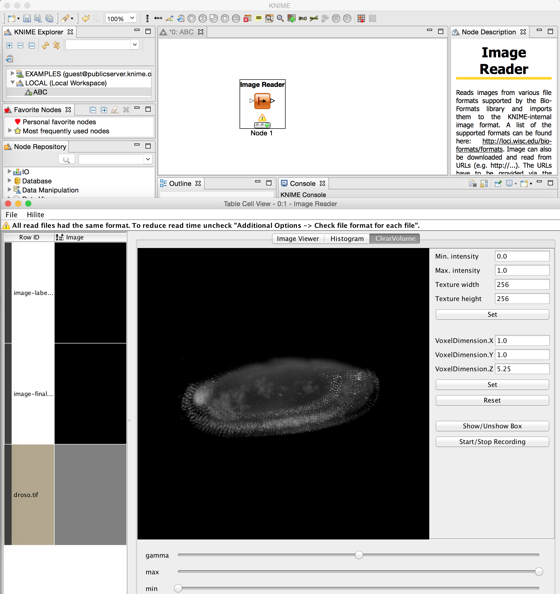

# ImgLib2 support for ClearVolume
This repository contains 
* all functionalities to bridge from loaded imglib2 image containers to ClearVolume.
* a ImageJ2/Fiji plugin that embedds [ClearVolume](https://bitbucket.org/clearvolume/clearvolume/wiki/Home) in a usable way.
* the uer interface can also be used in other contexts, e.g. as a [viewer plugin in KNIME](http://tech.knime.org/book/clearvolume).

#### You would like to see the final plugins that rely on this repository?

Sneak peak at the GUI in Fiji/ImagJ2:

The TableCellViewer [plugin in KNIME](http://tech.knime.org/book/clearvolume):

#### You would like to use ClearVolume plugin in Fiji/ImageJ2?
* Two hoops that will fall away soon but currently have to be taken:
  * Fiji must be started using Java 1.7 or 1.8 (or later?). See these [instructions](http://imagej.net/FAQ#How_do_I_launch_ImageJ_with_a_different_version_of_Java.3F).
  * Fiji must use the ImageJ2 data structures (imglib2). Enable in Fiji with 'Edit - Options - ImageJ2...'.
  * **Install ClearVolume plugin directly in Fiji**: 
    * Help - Update...
    * click 'Manage Update Sites'
    * check 'ClearVolume' in list of update sites and close window again.
    * update installs, **done**! 
  * Knime installation instructions can be found [here](http://tech.knime.org/book/clearvolume)

#### You would like a superficial explainatoin of thow it all works?

Since ClearVolume can, to date, only show images stored in native `byte` arrays we need to translate imglib2 image container to native byte type images. While this is ok for 8bit images, 16bit images are represented as arrays of type `short` in imglib.
Here you find two things that enable you to display every `RealType` image container coming from imglib2 into ClearVolume:
* `ClearVolumeUnsignedShortType` -- a alternative 16 bit `short` type image type implementation that uses a native `byte` array to store voxel intensities. An image that is loaded into any imglib2 container using a image factory with this new type can directly be shown in ClearVolume using static methods in class `ClearVolume`.
* For any other imglib2 container we offer the converter `RealClearVolumeUnsignedShortConverter`. Feel free to use this converter just as any other imglib2 converter, but we do also provide static convenience methods in class `ClearVolume`.
